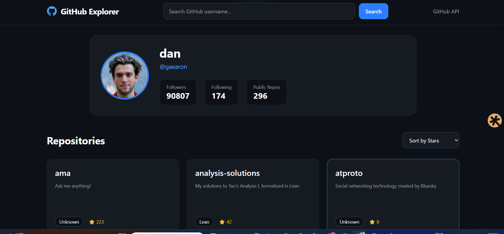
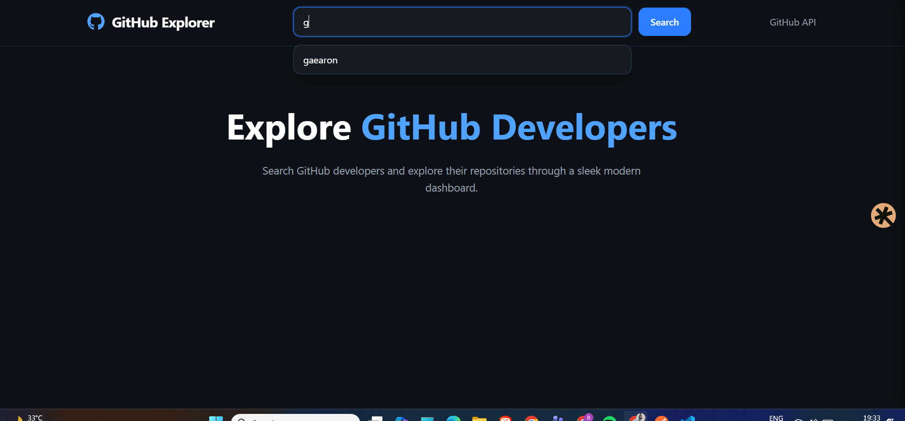

# GitHub Explorer

A modern full-stack GitHub explorer application that allows users to search GitHub profiles and explore repositories through a clean responsive dashboard.

---

## Features

### Backend Features

* GitHub API integration using Express.js
* Backend proxy for secure API requests
* In-memory caching for optimized performance
* Rate limiting to prevent API abuse
* Pagination support for repositories
* Structured service-based architecture
* Error handling for invalid users and API failures

### Frontend Features

* Search GitHub users instantly
* Responsive modern UI built with React and Tailwind CSS
* Dynamic profile card rendering
* Repository grid layout
* Repository sorting:

  * Sort by stars
  * Sort by name
  * Sort by last updated
* Load more pagination
* Loading states and error handling
* Autocomplete recent search suggestions
* Persistent recent searches using localStorage
* Mobile responsive design

---

## Tech Stack

### Frontend

* React
* Vite
* Tailwind CSS
* Axios

### Backend

* Node.js
* Express.js
* GitHub REST API

---

## Project Structure

```bash
github-explorer/
│
├── client/
│   ├── src/
│   ├── components/
│   └── App.jsx
│
├── server/
│   ├── routes/
│   ├── controllers/
│   ├── services/
│   ├── cache/
│   └── index.js
```

---

## Installation

### Clone Repository

```bash
git clone <your-repository-url>
```

---

### Backend Setup

```bash
cd server
npm install
npm run dev
```

Backend runs on:

```bash
http://localhost:5000
```

---

### Frontend Setup

```bash
cd client
npm install
npm run dev
```

Frontend runs on:

```bash
http://localhost:5173
```

---

## API Endpoint

```bash
GET /api/github/:username?page=1
```

Example:

```bash
/api/github/torvalds?page=1
```

---

## Screenshots





---

## Future Improvements

* Repository search support
* Charts for repository languages
* Debounced live search
* Skeleton loaders
* Advanced filtering

---

## Deployment

Frontend deployed on Vercel
Backend deployed on Render

---

## Author

Built by Bhavya Rajani
